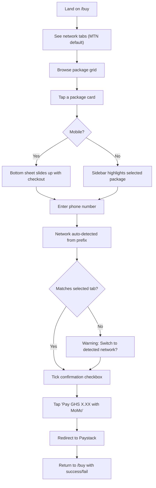
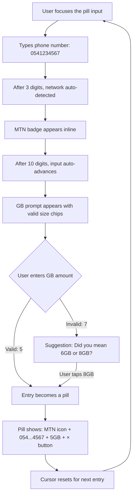

# `/buy` Page — Data Catalog & Purchase Flow

Build a dedicated, distraction-free `/buy` page that serves as the primary data purchasing experience for **guests, registered users, and agents**. The page combines a browsable data catalog with a streamlined checkout flow, and a **Smart Pill** bulk-purchase mode that guides users through each entry interactively.

## User Review Required

> [!IMPORTANT]
> **Mobile-first priority confirmed.** The entire layout is designed bottom-up from a 360px viewport, with desktop treated as progressive enhancement. All touch targets will be ≥ 48px.

> [!NOTE]
> **Agent pricing deferred.** All visitors are treated as guest-price for now. The page will include a marketing banner promoting first-purchase discounts for account holders and agent discounted rates to drive sign-ups.

## Resolved Decisions

1. **Payment method:** Both Paystack MoMo **and** Better Data Wallet. Logged-in users see a toggle to choose between "Mobile Money" and "Wallet" as payment method. Wallet deduction is immediate; MoMo redirects to Paystack.
2. **Order confirmation:** After Paystack confirms payment, redirect to `/buy/confirmation?ref=xxx` — a dedicated page showing the order number, order details (network, package, recipient, amount), and delivery status. This gives users a clear receipt-like view of what they just purchased.

---

## Network Auto-Detection

A core utility used across both Single and Bulk modes. Phone number prefixes map to networks:

| Network | Prefixes |
|---------|----------|
| **MTN** | 024, 054, 055, 059, 025, 053 |
| **Telecel** | 020, 050 |
| **AirtelTigo** | 027, 057, 026, 056 |

**Behavior:**
- As the user types a phone number, we check the first 3 digits against this map
- Once a prefix matches, we show a small **network badge** (colored dot + name) inline next to the input
- If the prefix doesn't match any network, we show a subtle warning: "Unknown network prefix"
- In **Bulk mode**, this replaces the need for a network tab selector — each entry auto-detects its own network from the phone number
- In **Single mode**, if the user has selected a network tab but types a number from a different network, we show a gentle warning: "This number looks like a Telecel number. Switch network?"

---

## Page Architecture

The `/buy` page is split into **two visual zones** stacked vertically on mobile and side-by-side on desktop:

```
┌──────────────────────────────────────────────────────┐
│  Navbar (shared — sticky)                            │
├──────────────────────────────────────────────────────┤
│  First-purchase discount banner (dismissible)        │
├──────────────────────────────────────────────────────┤
│                                                      │
│  ┌─────────────────────┐  ┌──────────────────────┐   │
│  │   DATA CATALOG       │  │   CHECKOUT SIDEBAR   │   │
│  │                     │  │                      │   │
│  │  Network Tabs       │  │  Selected Package    │   │
│  │  ───────────────    │  │  Phone Number Input  │   │
│  │  Package Grid       │  │  + Network Badge     │   │
│  │  (scrollable)       │  │  Confirmation        │   │
│  │                     │  │  Pay Button          │   │
│  │  [Single] [Bulk]    │  │  Trust badges        │   │
│  │                     │  │                      │   │
│  └─────────────────────┘  └──────────────────────┘   │
│                                                      │
├──────────────────────────────────────────────────────┤
│  Minimal Footer                                      │
└──────────────────────────────────────────────────────┘
```

**Mobile layout:** Full-width stacked. Catalog on top, checkout as a sticky bottom sheet that slides up when a package is selected.

**Desktop layout (≥960px):** Two-column — catalog left (60%), checkout sidebar right (40%, sticky).

---

## Proposed Changes

### Shared / Design System

#### [MODIFY] [globals.css](file:///c:/Users/Kevin/Projects/BetterData/apps/web/app/globals.css)

Add new CSS classes for the `/buy` page. These extend the existing design tokens (colors, radii, shadows, animations) without modifying any current styles.

**New styles include:**
- `.buy-page` — page-level layout container with subtle gradient background
- `.buy-header` — page title + breadcrumb area
- `.promo-banner` — dismissible first-purchase discount banner (gradient, icon, close button)
- `.network-tabs` — horizontal scrollable tab bar for network selection (mobile swipeable)
- `.mode-toggle` — "Single" / "Bulk" pill toggle switch
- `.catalog-grid` — responsive grid for package cards (2-col mobile, 3-col tablet, 4-col desktop)
- `.pkg-card` — individual package card with size, price, and selection state
- `.pkg-card--popular` — highlighted "popular" badge variant
- `.checkout-panel` — sticky sidebar/bottom-sheet for checkout
- `.checkout-summary` — order summary with package + price breakdown
- `.network-badge` — inline detected-network indicator (colored dot + label)
- `.network-mismatch-warning` — subtle warning when phone prefix doesn't match selected network
- **Smart Pill styles:**
  - `.pill-input-container` — the wrapper that holds pills + active input
  - `.pill` — individual entry pill (phone + network icon + GB size)
  - `.pill--valid` — green-tinted valid pill
  - `.pill--error` — red-tinted error pill
  - `.pill__remove` — × button on each pill
  - `.gb-suggestion` — dropdown showing closest valid GB options
  - `.gb-chip` — quick-select chip for valid GB amounts
- `.bottom-sheet` — mobile-only slide-up panel with drag handle
- Responsive breakpoints following existing pattern (768px, 960px)

---

### Buy Page (New Route)

#### [NEW] [page.tsx](file:///c:/Users/Kevin/Projects/BetterData/apps/web/app/buy/page.tsx)

The main `/buy` page component. This is a `"use client"` component.

**Data & State:**
- Fetches packages via `betterDataApi.listDataPackages()` (same as landing page)
- URL search params: `?network=mtn` (optional pre-selection from landing page)
- Local state: `network`, `mode` (single/bulk), `selectedPackageId`, `phone`, `recipientConfirmed`, `paymentResult`
- Bulk state: `bulkPills[]` — array of `{ phone, detectedNetwork, packageSizeMb, packageId, isValid, error? }` objects
- Helper: `detectNetwork(phone)` — returns network ID or `null` from prefix map

**Component Structure:**

```tsx
<main className="buy-page">
  <PromoBanner />                  {/* First-purchase discount */}
  <BuyHeader />                    {/* Title + breadcrumb */}

  <div className="buy-layout">
    {/* LEFT: Catalog */}
    <section className="buy-catalog">
      <NetworkTabs />              {/* MTN | Telecel | AirtelTigo tabs */}
      <ModeToggle />               {/* Single | Bulk toggle */}

      {mode === 'single' ? (
        <PackageCatalog />         {/* Grid of package cards */}
      ) : (
        <SmartPillInput />         {/* Interactive pill-based bulk entry */}
      )}
    </section>

    {/* RIGHT: Checkout */}
    <aside className="checkout-panel">
      {mode === 'single' ? (
        <SingleCheckout />         {/* Phone, confirm, pay */}
      ) : (
        <BulkCheckout />           {/* Total summary from pills, pay */}
      )}
    </aside>
  </div>

  {/* MOBILE: Bottom sheet overlay */}
  <MobileCheckoutSheet />
</main>
```

---

## Detailed UX Flows

### Flow 1: Single Purchase (Primary)

This is the core flow — a user browses the catalog and buys one package for one phone number.



**Package Grid Design (Single Mode):**

Each card in the catalog grid displays:

| Element | Description |
|---------|-------------|
| **Size badge** | Large, bold — e.g. "5GB" |
| **Price** | Below size — "GHS 20.75" |
| **Value indicator** | Subtle per-GB price for comparison — "GHS 4.15/GB" |
| **Popular badge** | Gold accent on the 5GB and 10GB packages |
| **Best Value badge** | On 10GB and 15GB (lowest per-GB cost) |
| **Selection ring** | Teal border + checkmark when selected |

**Full Package Catalog (from provided pricing):**

| Size | Price (GHS) | Per-GB |
|------|-------------|--------|
| 1GB | 4.15 | 4.15 |
| 2GB | 8.30 | 4.15 |
| 3GB | 12.45 | 4.15 |
| 4GB | 16.60 | 4.15 |
| 5GB | 20.75 | 4.15 |
| 6GB | 24.80 | 4.13 |
| 8GB | 33.20 | 4.15 |
| 10GB | 40.00 | 4.00 |
| 15GB | 57.50 | 3.83 |
| 20GB | 77.50 | 3.88 |
| 25GB | 97.50 | 3.90 |
| 30GB | 116.50 | 3.88 |
| 40GB | 153.50 | 3.84 |
| 50GB | 193.00 | 3.86 |

> [!TIP]
> Packages 10GB+ have better per-GB value. We'll highlight this with a subtle "Best Value" tag on 10GB and 15GB cards to guide users toward higher-value purchases.

---

### Flow 2: Smart Pill Bulk Purchase

This is the **killer feature** — an interactive, guided bulk entry system inspired by email invitation token inputs. Instead of a raw textarea or CSV upload, users build their order visually one entry at a time, with real-time validation and network auto-detection.

#### How It Works

The UI is a single container that looks like a text input, but holds completed "pills" plus an active cursor at the end — exactly like Gmail's "To:" field or Slack's multi-person invite.

**Step-by-step interaction:**



#### The Pill Anatomy

Each completed pill in the container shows:

| Element | Description |
|---------|-------------|
| **Network icon** | Small colored dot (yellow=MTN, red=Telecel, blue=AT) |
| **Phone number** | Formatted: `054 123 4567` |
| **Package size** | Bold: `5GB` |
| **Price** | Muted: `GHS 20.75` |
| **Remove button** | × icon on hover/tap to delete the pill |

Valid pills have a subtle green-tinted background. Error pills (e.g. unrecognized prefix) have a red tint with an error tooltip.

#### GB Size Validation & Suggestions

When the user enters the GB amount after the phone number:

- **Exact match** (e.g. `5`): Immediately creates the pill with the 5GB package
- **Invalid amount** (e.g. `7`): Shows a small dropdown with two options:
  - "6GB — GHS 24.80" (closest lower)
  - "8GB — GHS 33.20" (closest higher)
  - User taps one to confirm
- **Out of range** (e.g. `100`): Shows "Maximum available: 50GB — GHS 193.00"
- **Quick-select chips**: Below the input, show the most common sizes as tappable chips: `1  2  3  5  10  15  20  50` so users can just tap instead of typing

#### Bulk Input Alternatives

While the Smart Pill input is the primary method, we also support:
- **Paste support**: If the user pastes multi-line text (e.g. from a spreadsheet), we auto-parse each line as `phone,gb` and create pills for all valid entries at once
- **CSV/Excel upload**: A small "Upload file" link below the pill container that accepts `.csv` or `.xlsx` files and populates pills from the parsed data

#### Bulk Checkout Summary

As pills accumulate, the checkout sidebar (or bottom sheet on mobile) updates in real-time:

| Summary Element | Example |
|----------------|---------|
| **Total entries** | "12 recipients" |
| **By network** | "8 MTN, 3 Telecel, 1 AirtelTigo" |
| **Total cost** | "GHS 284.50" |
| **Invalid count** | "2 entries need attention" (if any) |
| **CTA button** | "Pay GHS 284.50 for 12 bundles" |

---

### Mobile Bottom Sheet UX

On mobile (< 960px), when no package is selected (single mode) or no pills exist (bulk mode), the checkout panel is hidden. Once a user taps a package card or creates their first pill:

1. **Bottom sheet slides up** from the bottom with a drag handle
2. Shows the relevant checkout (Single or Bulk summary)
3. **Swipe down** to dismiss and return to browsing
4. The sheet takes up ~60% of the viewport height
5. Background catalog is dimmed with a semi-transparent overlay
6. Sheet has rounded top corners and a subtle shadow

This pattern is familiar from mobile shopping apps (Uber Eats, Jumia) and keeps the browsing experience uninterrupted.

---

## Component Breakdown

### `PromoBanner`
- Gradient banner at top of page (teal-to-dark, matching brand)
- Text: "Create a free account and get GHS X off your first purchase!"
- Small "Sign Up" link and a dismiss × button
- Stored in `localStorage` to not re-show after dismissal
- On agent-specific variant: "Become an agent for discounted rates on every bundle"

### `BuyHeader`
- Breadcrumb: Home > Buy Data
- Title: "Buy Data Bundles"
- Subtitle: "Choose your network and package below"

### `NetworkTabs`
- Three tab buttons: MTN (yellow accent), Telecel (red accent), AirtelTigo (blue accent)
- Horizontally scrollable on mobile, centered on desktop
- Active tab has bold underline in network brand color
- Reading `?network=` query param for initial selection
- In Bulk mode, tabs are hidden (network is auto-detected per entry)

### `ModeToggle`
- Pill-shaped toggle: `[Single] [Bulk]`
- Smooth sliding indicator animation
- "Bulk" shows a small count badge when pills are loaded

### `PackageCatalog`
- Responsive grid of `PackageCard` components
- Loading: skeleton cards (shimmer animation)
- Error: inline retry prompt
- Empty: "No packages available for this network"

### `PackageCard`
- Glassmorphism-lite card with hover lift effect
- Size in large display font, price below
- Per-GB value as muted subtext
- Selected state: teal border, subtle glow, checkmark icon
- "Popular" / "Best Value" badge where applicable
- Touch-friendly: entire card is tappable, min 48px height

### `SingleCheckout`
- **Order summary**: network icon + selected package (size + price)
- **Phone input**: tel input with format hint, validated for 10-digit Ghana numbers
- **Network badge**: auto-detected network shown inline as colored dot + name
- **Network mismatch warning**: if detected network ≠ selected tab, show a switch prompt
- **Confirmation checkbox**: same disclaimer as landing page
- **CTA button**: "Pay GHS XX.XX with MoMo" — full-width, primary color, disabled until valid
- **Trust footer**: Lock icon + "Secured by Paystack"
- **Error display**: inline error banner
- **Payment result**: reference, status, refresh button (reuses landing page pattern)

### `SmartPillInput`
- **Container**: looks like a large text input, holds pills + active cursor
- **Active input**: at the end of the pill row, accepts phone number then GB amount
- **Phase indicator**: subtle label showing "Enter phone number" → "Enter data size (GB)"
- **Network badge**: appears inline after 3 digits typed, showing detected network
- **GB chips**: row of tappable quick-select chips below input: `1  2  3  5  10  15  20  50`
- **GB suggestion dropdown**: appears for invalid amounts, showing closest lower + higher options
- **Completed pills**: inline pill elements with network dot, phone, size, price, × remove
- **Paste handler**: `onPaste` intercept that parses multi-line text into pills
- **Upload link**: "or upload CSV/Excel" link that opens file picker
- **Actions bar**: "Clear All" button, entry count

### `BulkCheckout`
- **Live summary**: total entries, breakdown by network, total cost
- **Error count**: "2 entries need attention — tap to review" with auto-scroll
- **CTA button**: "Pay Total GHS XXX.XX for N bundles"
- Disabled while any pills have validation errors

### `MobileCheckoutSheet`
- CSS-only bottom sheet (no JS library needed)
- Triggered by `selectedPackageId` (single) or `bulkPills.length > 0` (bulk)
- Drag handle visual indicator at top
- Overlay backdrop with `onClick` to dismiss
- Contains `SingleCheckout` or `BulkCheckout` depending on mode

---

## Network Detection Utility

```typescript
const NETWORK_PREFIXES: Record<string, NetworkCode> = {
  '024': 'mtn', '054': 'mtn', '055': 'mtn',
  '059': 'mtn', '025': 'mtn', '053': 'mtn',
  '020': 'telecel', '050': 'telecel',
  '027': 'airteltigo', '057': 'airteltigo',
  '026': 'airteltigo', '056': 'airteltigo',
};

function detectNetwork(phone: string): NetworkCode | null {
  const cleaned = phone.replace(/\D/g, '');
  const prefix = cleaned.substring(0, 3);
  return NETWORK_PREFIXES[prefix] ?? null;
}

const VALID_SIZES_GB = [1, 2, 3, 4, 5, 6, 8, 10, 15, 20, 25, 30, 40, 50];

function suggestSizes(input: number): { lower: number | null; higher: number | null } {
  let lower: number | null = null;
  let higher: number | null = null;
  for (const size of VALID_SIZES_GB) {
    if (size <= input) lower = size;
    if (size >= input && higher === null) higher = size;
  }
  return { lower: lower === input ? null : lower, higher: higher === input ? null : higher };
}
```

---

## File Structure

```
apps/web/app/
├── buy/
│   └── page.tsx          ← Main /buy page (all components inline for now)
├── globals.css           ← Extended with buy-page styles
├── layout.tsx            ← Unchanged (shared navbar/theme logic)
└── page.tsx              ← Landing page (unchanged)
```

> [!NOTE]
> All components are kept inline in `page.tsx` for now (matching the existing pattern in the landing page). We can extract to a `components/` directory in a follow-up refactor.

---

## Shared Elements

The `/buy` page will **reuse** from the landing page:
- Navbar (same component, extracted or duplicated)
- Network logos (MTN, Telecel, AirtelTigo SVGs)
- Icon components (ShieldIcon, LockIcon, CheckIcon, ZapIcon)
- API client setup (`betterDataApi`)
- Helper functions (`formatPackageSize`, `readApiError`, `requirePublicEnv`)
- Theme toggle logic
- Footer (minimal version)

> [!IMPORTANT]
> Since the landing page currently has all components inline in `page.tsx`, we will **duplicate the shared elements** (navbar, icons, logos, API setup) into the buy page for now. A shared component extraction should be a follow-up task.

---

## Visual Design Principles

### Mobile-First Layout
- **360px baseline** — everything must work perfectly here
- **Thumb zone optimization** — primary actions (pay button) anchored to bottom
- **Single-column flow** — no horizontal scrolling except network tabs
- **Bottom sheet pattern** — native-feeling checkout overlay
- **Smart Pill input** optimized for one-handed mobile use

### Premium Aesthetics (matching existing design system)
- Subtle gradient background matching `.buy-page` to `.hero` tones
- Glassmorphism on checkout panel (backdrop-filter blur)
- Micro-animations: card selection spring, sheet slide-up, skeleton shimmer, pill creation/removal
- Network brand colors used as accents (MTN yellow, Telecel red, AT blue)
- Pill animations: scale-in on creation, fade-out on removal
- Consistent use of `var(--radius-lg)`, `var(--shadow-md)`, etc.

### Accessibility
- All interactive elements ≥ 48px touch target
- Focus-visible outlines on all buttons/inputs
- ARIA labels on network tabs, toggle, cards, and pills
- Semantic HTML: `<nav>`, `<aside>`, `<section>`, `<table>`
- Color contrast meets WCAG AA
- Pills are keyboard-navigable (arrow keys, backspace to delete last)

---

## Verification Plan

### Automated Tests
```bash
# Build check — ensure the page compiles
cd apps/web && npx next build

# Lint check
pnpm lint
```

### Browser Testing
- Open `/buy` and verify:
  1. Network tabs switch and filter packages correctly
  2. Package grid renders all 14 package sizes with correct prices
  3. Clicking a package updates the checkout sidebar
  4. Phone input validates 10-digit Ghana format
  5. **Network auto-detection** shows correct badge after 3 digits typed
  6. Network mismatch warning appears when prefix doesn't match selected tab
  7. Confirmation checkbox enables the pay button
  8. Form submission creates a payment intent
  9. Theme toggle (light/dark) works correctly
  10. Mobile bottom sheet behavior at < 960px viewport
  11. Promo banner displays and dismisses correctly

### Bulk Mode Testing
- Switch to Bulk mode and verify:
  1. **Smart Pill creation**: type phone → see network badge → type valid GB → pill created
  2. **Invalid GB handling**: type `7` → see suggestions for 6GB and 8GB → tap one → pill created
  3. **Pill removal**: click × on a pill → pill removed with animation → total updates
  4. **Paste support**: paste multi-line `phone,gb` text → pills auto-created
  5. **Network auto-detection per pill**: MTN numbers get yellow dot, Telecel red, AT blue
  6. **Checkout summary**: total cost, entry count, and per-network breakdown update live
  7. **Error state**: invalid phone prefix shows red-tinted pill with error tooltip

### Manual Verification
- **Mobile viewport** (375px): Verify bottom sheet slides up on package selection
- **Tablet viewport** (768px): Verify 3-column package grid
- **Desktop viewport** (1200px): Verify 2-column layout with sticky sidebar
- **Dark mode**: Verify all elements have proper contrast
- **Smart Pill on mobile**: Verify pill input is comfortable for one-handed use
